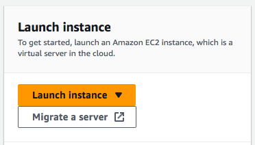

# AWS
## Signing in
- When first signed in, the region selected must be Europe (Ireland)-
- Then locate to EC2
- There should be an option in orange to launch an instance.

- The naming convention should be "tech230_Jamie_first_ec2"
- Under applications, we selct "ubuntu server 20.04 LTS". However, make sure it is the free version. 
- For the key pair, we can select tech230. 
- Inside the security group name, use the naimg conventin: "tech230_Jamie_first_sg"
- In security, select the source type: "Anywhere"
- We can then click launch.
- We can then easily navigate to the instance we just made. There should be an option called "connect" at the top.
- Click on that an select "SSH Client"

## Git terminal
- ` ~/.ssh `
- ` cd .ssh `
- We can then copy and paste the two commands into the terminal that is given to us on AWS after clicking "connect".
- We can then do the standard: ` sudo apt-get update -y `
- ` sudo apt-get upgrade -y `
- ` sudo systemctl start nginx `
- ` sudo systemctl enable nginx `
- ` sudo systemctl status nginx `
## Back in AWS
- If we go to our instance summary page, we can scroll down to the tab that says "security"
- Here, there should be a link called "security group".
- We can edit the inbound rules here.
- We add a "HTTP" on source 0.0.0.0/0
- If we want, we can do the same for "HTTPS" on source 0.0.0.0/0
- If we then go to our instance, we can find a part that says "Public address". 
- If we search that address, we should get the "Welcome to nginx" message. 

