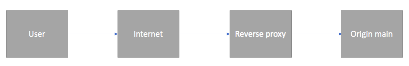

## What are ports?
- It's used to be able to uniquely identify a connection endpoint, and to direct data to  specific service.
## What is a reverse proxy
- It is a gateway between the users and the servers. It revieves requests from the users, and directs them to the origin main. 

# Add reverse proxy 
- Needs to be done in app terminal while the app is running

## Installing node.js
- type ` cd ~ `
- Then ` curl -sL https://deb.nodesource.com/setup_16.x -o nodesource_setup.sh `
- ` sudo bash nodesource_setup.sh `
- ` sudo apt-get install nodejs `
- ` sudo apt-get install build-essential `

## Creating the reverse proxy
- enter ` sudo nano /etc/nginx/sites-available/default `
- You should see a large block of code
- You should see ` server_name _; `
- Change the "_" to "192.168.10.100"
- For the location part,change it to:

location / {
            proxy_pass http://localhost:3000;
         proxy_http_version 1.1;
            proxy_set_header Upgrade $http_upgrade;
            proxy_set_header Connection 'upgrade';
            proxy_set_header Host $host;
            proxy_cache_bypass $http_upgrade;
    }

location /posts {
            proxy_pass http://localhost:3000/posts;
            proxy_http_version 1.1;
            proxy_set_header Upgrade $http_upgrade;
            proxy_set_header Connection 'upgrade';
            proxy_set_header Host $host;
            proxy_cache_bypass $http_upgrade;
    } 
- It should look like this:
- .png)
- The second {} is for the second VM
- Note: The indentation needs to be perfect
- To check, type ` sudo nginx -t `
#
- Type ` sudo systemctl restart nginx `
- Then ` node app.js `
- Check: ` 192.168.10.100/posts ` to see if it worked

