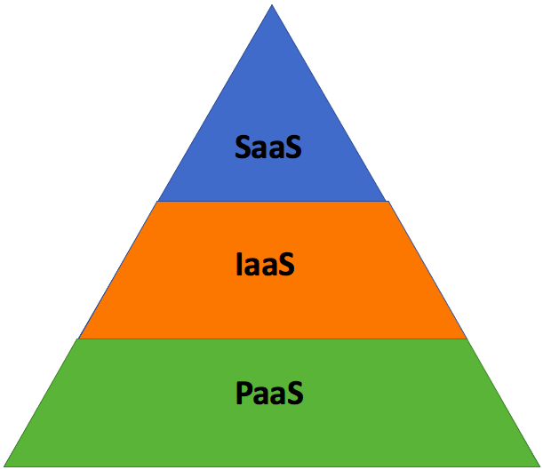

# Cloud computing

## What is cloud computing?
- It is the on demand availabilty of computer system resources. These resources often include data storage, computing power, software testing and development and data anlysis. 

## Quick history
- There are three fundamentals that define the cloud: delivering a service, multiple people sharing the same computer resource and accessing services via network. 
- Cloud technology reached a maturity in the 90's, which was epitomised by the launch of the world wide web (www) in 1991. 
- The modern day cloud was released in 2002 by Amazon web services (AWS).

## Cloud benefits
- Scalability: The infastructure can be scaled on demand.
- Accesability: accesable from almost any internet connection.
- Data security: Hardware failures don't result in data loss.
- Collaboration: All teams members can collaborate easily ogether 
- High levels of security
- Cost: You only pay for the resources that you use.

## What is AWS? 
- Worlds largest cloud and api service, launched in 2002.

## Quick history of AWS
- The web services were launched in 2002, and the cloud services in 2006.
- Was initially designed to support their own e-commerce buisness. 
- Was soon after made available to other buisnesses as a way to build, deploy and scale applications. 
- It is now the largest cloud provider in the world.

## Other cloud providers
- Microsoft Azure
- Google cloud Platform
- Oracle
- Salesforce
- IBM
- Adobe

## What is IAAS, PAAS and SAAS?
### Infastructure as a service (IAAS)
- A third party provides you with infastructure services, like storage and virtualisation.
- The user is responsible for the operation system, data etec.

### Platform as a service (PAAS)
- A provider hosts the hardware and software.
- You do the app development yourself, however you don't need to deal with software updates or hardware maintinance. 
### Software as a service (SAAS)
- Also known as cloud application service, delivers an entire application that is managed by a provider.
- Software updates, bug fixes and general software maintinance are handled by the provider, and the user connects with an API. 
- An example is having an email address. 
- 

## Difference between public, hybric and private cloud
- The private cloud makes all data and other info only available to users within the organisation
- The public cloud means that data and other infor can be delivered over the internet to various other organisations and people. 
- The hybrid cloud uses both the public and private cloud.

## Who uses the private cloud?
- Organisations who have predictable and consistent resource demands, as they can save costs.
- An organisaion with security concers, as the private cloud is more secure. 
- They have more control ovr the network they're using.
- Instagram, dropbox, walmart and apple all use private clouds. 
## What is operating and capital expenditure? 
- Operating expenditiure is the money a company spends day-to-day to run the buisness.
- Capital expenditure is the money a cmpany spends by aquiring or maintaning assets, like buildings, land and equipment. 
## Which spending is preferable?
- They both have their advantages and disadvantages.
- Capital is preffered when a buisness has a stable and predictable demand for its products and services.
- Operating is preffered when a buisness has unpredictable demands, as it allows for better flexibility when adapting to changes. 
- The cloud transfers capital spending to operating spending as the buisness can have pay-as-you-go on the services.
- They can avoid the costs of physical maintinance of assets.
- They can also cale up or down in response to any changes.

## Case study 1 (Netflix)
- As of January 2016, Netflix has expanded into 130 new countries. It uses multiple AWS Cloud regions which are spread all over the world.
- Netflix relies on Cloud for all its scalability, computing, and storage needs. 
- When Netflix was using their own data centers, it faced a lot of outages.
- Netflix reduced costs due to the elasticity factor of cloud computing, enabling Netflix to continuously optimize instances to grow and shrink as per requirement. 
## Case study 2 (Airbnb)
- A year after Airbnb launched, the company decided to migrate nearly all of its cloud computing functions to Amazon Web Services (AWS) because of service administration challenges experienced with its original provider.
- By moving to the cloud, airbnb gained the ability to scale quickly.
- This drastically increased the number of sustomers that they could handle. 

## Case study 3 (F1)
- They migrated to AWS in 2018.
- The sport is data-driven, with lots of it being produced each race.
- By analysing the data with AWS, F1 can process key information. 